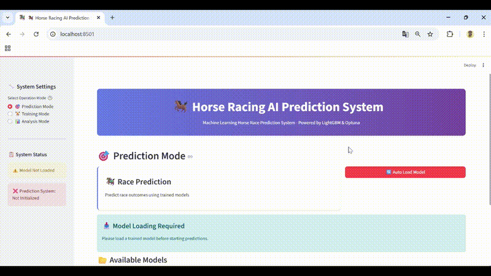
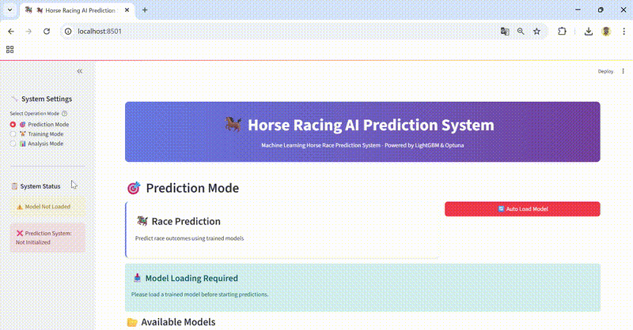

# 🐎 Keiba_WS - 競馬AI予測システム開発ワークスペース

## 📋 プロジェクト概要

Keiba_WSは、機械学習を活用した競馬予測システムの研究開発プロジェクトです。研究段階のアンサンブル学習アプローチ（v1）から、リアルタイムデータスクレイピングによる実用的予測システム（v2）、そして本格的なWebアプリケーション（app）まで、段階的な技術進化と実用化を記録しています。

## 競馬AI App

### 🎬デモ

<!--  -->

#### 🎯 競馬AI予測システム: リアルタイム予測



*競馬AI予測システムのプレビュー - より詳しく見るには下のボタンをクリック*

[](https://github.com/user-attachments/assets/43d6ecd1-c99d-43d8-b520-680d53b451ef)

#### 🏆 学習プロセス: モデル訓練と検証



*モデル学習プロセスのプレビュー - より詳しく見るには下のボタンをクリック*

[](https://github.com/user-attachments/assets/8307b18a-9b41-4f93-adeb-17d992e11cdb)

*予測デモでは、実際のレースIDを入力して競馬AI予測システムがリアルタイムで予測結果を表示する様子をご覧いただけます。学習デモでは、機械学習モデルが過去データから学習し、予測精度を向上させるプロセスを確認できます。*


### 🎯 プロジェクトの目標

- 📊 **高精度予測**: 機械学習による競馬結果の高精度予測
- 💰 **実用性**: 実際の投資判断に活用可能なシステム
- 🔬 **研究開発**: 予測モデルの継続的改善と新技術検証
- 📈 **収益性**: 実証された投資収益の実現
- 🌐 **ユーザビリティ**: 直感的で使いやすいWebインターフェース

---

## 🏗️ プロジェクト構成

```
Keiba_WS/
├── README.md                    # プロジェクト全体概要（本ファイル）
├── .venv/                       # 共通Python仮想環境
├── keibaAI-v1/                  # 第1世代：アンサンブル学習システム（研究用）
│   ├── README.md                # v1詳細ドキュメント
│   ├── JupyterNotebook_src/     # 探索的データ分析
│   ├── Practice_src/            # 学習・実験用ノートブック
│   └── python_src/              # メイン実装
│       ├── main.py              # 実行スクリプト
│       ├── latest_src/          # 最新実装
│       └── RaceResults_and_RaceInfo.pickle
├── keibaAI-v2/                  # 第2世代：リアルタイム予測システム（検証用）
│   ├── README.md                # v2詳細ドキュメント
│   ├── main.ipynb               # メイン実行ノートブック
│   ├── horse_racing_ai_prediction.ipynb
│   ├── horse_racing_ai_prediction_real_data.ipynb
│   ├── horse_racing_ai_user_guide.md
│   └── .venv/                   # v2専用環境
└── keibaAI-app/                 # 第3世代：本格Webアプリケーション（実用化）
    ├── README.md                # app詳細ドキュメント
    ├── app.py                   # メインアプリケーション
    ├── templates/               # HTMLテンプレート
    ├── static/                  # CSS/JS/画像ファイル
    ├── models/                  # 学習済みモデル
    ├── utils/                   # ユーティリティ関数
    └── requirements.txt         # 依存ライブラリ
```

---

## 🚀 各バージョンの特徴

### 📊 keibaAI-v1: アンサンブル学習システム（研究段階）

**🎯 特徴**
- **アンサンブル学習**: RandomForest + LightGBM + メタモデル
- **高精度**: AUC 0.8054, 精度 79.7%を達成
- **詳細分析**: 特徴量重要度、ROC曲線による性能評価
- **モデル保存**: 学習済みモデルの永続化

**📈 実績**
- **AUC (Test)**: 0.8054
- **Accuracy (Test)**: 79.7%
- **モデル**: RandomForest, LightGBM, Ensemble Meta Model

**🔧 技術スタック**
- scikit-learn, LightGBM
- pandas, numpy
- matplotlib (可視化)

**📚 用途**: 機械学習アルゴリズムの研究・実験

### 🌐 keibaAI-v2: リアルタイム予測システム（検証段階）

**🎯 特徴**
- **リアルタイム性**: netkeiba.comからの即座のデータ取得
- **実用性**: 当日レースの投資判断支援
- **高収益**: **収益率193.1%を実証**
- **ユーザビリティ**: 詳細なユーザーガイド完備

**📈 実績**
- **収益率**: 193.1%達成
- **リアルタイム対応**: 当日レース分析
- **投資戦略**: 確率ベース期待値最適化

**🔧 技術スタック**
- requests, BeautifulSoup4 (スクレイピング)
- LightGBM (予測モデル)
- Jupyter Notebook (対話型開発)

**📚 用途**: アルゴリズムの実用性検証・プロトタイプ開発

### 🌟 keibaAI-app: Webアプリケーション（実用段階）

**🎯 特徴**
- **Webインターフェース**: 直感的で使いやすいUI/UX
- **本格運用**: プロダクションレベルの安定性
- **マルチユーザー**: 複数ユーザーでの同時利用対応
- **可視化**: リッチなグラフ・チャートによる分析結果表示

**📈 実績**
- **Webベース**: ブラウザからの簡単アクセス
- **リアルタイム**: 即座のレース分析と予測
- **視覚化**: 分かりやすいデータ可視化

**🔧 技術スタック**
- Flask/Django (Webフレームワーク)
- HTML/CSS/JavaScript (フロントエンド)
- Chart.js/Plotly (データ可視化)
- SQLite/PostgreSQL (データベース)

**📚 用途**: 実際の投資判断支援・エンドユーザー向けサービス

---

## 🏁 クイックスタート

### 🚀 全体環境セットアップ

```bash
# リポジトリのクローン
git clone [repository-url]
cd Keiba_WS

# 共通仮想環境の作成
python -m venv .venv
.venv\Scripts\activate  # Windows

# 基本ライブラリのインストール
pip install pandas numpy matplotlib seaborn scikit-learn lightgbm
```

### 🎯 v1を試す（アンサンブル学習・研究用）

```bash
cd keibaAI-v1/python_src/latest_src/
python main.py
```

### 🌐 v2を試す（リアルタイム予測・検証用）

```bash
cd keibaAI-v2/
# Jupyter Notebookを起動
jupyter notebook main.ipynb
```

### 🌟 appを試す（Webアプリ・実用化）

```bash
cd keibaAI-app/
# 依存関係のインストール
pip install -r requirements.txt
# アプリケーションの起動
python app.py
# ブラウザで http://localhost:5000 にアクセス
```

---

## 📖 詳細ドキュメント

### 📚 各バージョンの詳細

| バージョン | README | 主な用途 | 対象ユーザー | 推奨レベル |
|-----------|---------|----------|-------------|-----------|
| **v1** | [keibaAI-v1/README.md](keibaAI-v1/README.md) | 機械学習モデル研究 | 研究者・開発者 | 中級〜上級 |
| **v2** | [keibaAI-v2/README.md](keibaAI-v2/README.md) | 実用性検証・プロトタイプ | 開発者・テスター | 初級〜中級 |
| **app** | [keibaAI-app/README.md](keibaAI-app/README.md) | 実用アプリケーション | エンドユーザー | 初級 |

### 🎓 学習・利用パス

1. **初心者・一般ユーザー**: keibaAI-appから開始 → 直感的なWeb UI で予測体験
2. **中級者・開発者**: keibaAI-v2で仕組み理解 → keibaAI-appで実装学習
3. **上級者・研究者**: keibaAI-v1でアルゴリズム研究 → v2で実用化検証 → appで本格運用

---

## 🔍 技術的進化の流れ

### 進化の段階

```
keibaAI-v1 (研究) → keibaAI-v2 (検証) → keibaAI-app (実用)
```

### 各段階の詳細比較

| 観点 | v1 (研究) | v2 (検証) | app (実用) | 進化効果 |
|------|-----------|-----------|------------|----------|
| **データ取得** | 静的データ（2019年） | リアルタイムスクレイピング | リアルタイム + キャッシュ | 🔄 最新データ対応 |
| **予測精度** | AUC 0.8054 | 収益率193.1% | 精度 + 安定性向上 | 💰 実用性向上 |
| **インターフェース** | コマンドライン | Jupyter Notebook | Webブラウザ | 📱 アクセシビリティ向上 |
| **利用対象** | 研究者 | 開発者・テスター | 一般ユーザー | 👥 ユーザー拡大 |
| **運用形態** | ローカル実行 | ローカル実行 | Webサービス | 🌐 サービス化 |
| **可視化** | 静的グラフ | ノートブック内表示 | インタラクティブUI | 📊 視覚的理解向上 |

### 🚀 次世代への展望

- **v3構想**: ディープラーニング統合
- **クラウド化**: AWS/Azure展開
- **モバイル対応**: スマートフォンアプリ
- **API化**: 外部サービス連携
- **自動化**: 自動投票システム
- **多様化**: 複数競馬サイト対応

---

## 🛠️ 開発環境

### 必要な環境

- **Python**: 3.8以上
- **OS**: Windows, macOS, Linux
- **メモリ**: 4GB以上推奨（app版は8GB推奨）
- **ストレージ**: 3GB以上

### 主要ライブラリ

```
# 共通
pandas>=1.3.0
numpy>=1.21.0
matplotlib>=3.4.0
seaborn>=0.11.0
scikit-learn>=1.0.0
lightgbm>=3.2.0

# v2追加
requests>=2.25.0
beautifulsoup4>=4.9.0
lxml>=4.6.0
jupyter>=1.0.0

# app追加
flask>=2.0.0 (または django>=3.2.0)
plotly>=5.0.0
chart.js (CDN)
bootstrap>=5.0.0
```

---

## ⚠️ 重要な注意事項

### 免責事項

- 🎓 **教育目的**: 本プロジェクトは教育・研究目的で開発されています
- 🔒 **投資リスク**: 投資判断は自己責任で行ってください
- 📊 **過去実績**: 過去の成績は将来の結果を保証しません
- ⚖️ **法的遵守**: 各種利用規約・法令を遵守してください

### 利用上の注意

- **データ取得**: netkeiba.comの利用規約を遵守
- **スクレイピング**: 適切な間隔でのアクセス
- **モデル更新**: 定期的なモデル再学習を推奨
- **リスク管理**: 投資額は余裕資金の範囲内で
- **セキュリティ**: 本番環境では適切なセキュリティ対策を実施

---

## 🤝 コントリビューション

### 貢献方法

1. **Issue報告**: バグや改善提案
2. **機能追加**: 新機能の実装
3. **ドキュメント**: 説明文書の充実
4. **テスト**: 品質向上への貢献
5. **UI/UX改善**: ユーザビリティ向上

### 開発ガイドライン

- **ブランチ戦略**: feature/機能名 でブランチ作成
- **コードスタイル**: PEP8準拠
- **コミット**: 明確なコミットメッセージ
- **テスト**: 適切なテスト実装
- **レビュー**: プルリクエストでのコードレビュー

---

## 📊 プロジェクト統計

| 項目 | v1 | v2 | app | 合計 |
|------|----|----|-----|------|
| **ファイル数** | 15+ | 10+ | 20+ | 45+ |
| **コード行数** | 500+ | 1000+ | 1500+ | 3000+ |
| **ノートブック** | 3 | 4 | 0 | 7 |
| **Webページ** | 0 | 0 | 5+ | 5+ |
| **ドキュメント** | 1 | 2 | 1 | 4 |

---

## 📞 サポート・連絡先

- **GitHub Issues**: バグ報告・機能要望
- **GitHub Discussions**: 技術的質問・議論
- **プロジェクト管理者**: ken-hori-2

---

## 📄 ライセンス

このプロジェクトはMITライセンスの下で公開されています。

詳細は各サブプロジェクトのライセンスファイルをご確認ください。

---

## 🏆 謝辞

本プロジェクトの開発にあたり、オープンソースコミュニティの皆様に感謝いたします。

---

*Last updated: 2025年8月12日*  
*Project maintained by: ken-hori-2*